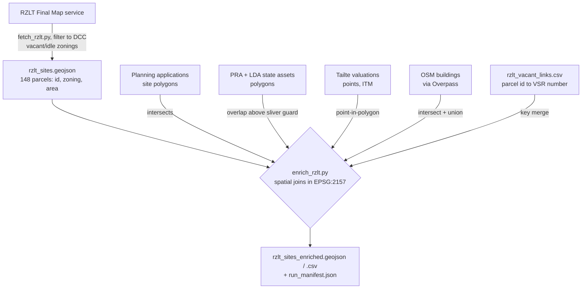

# RZLT parcel enrichment

How the Residential Zoned Land Tax (RZLT) vacant/idle parcels for Dublin City
are enriched with ownership, planning, valuation, and building-footprint data,
and where that data comes from.

## Why this exists

The Vacant Sites Register was frozen when the vacant sites levy was replaced by
the RZLT; the RZLT final map is its living successor. That map, however,
publishes almost nothing about each parcel: a boundary, a zoning class, an
area, and an internal parcel identifier. It does not say who owns the land,
whether anything is built on it, what planning history it has, or whether it is
rated.

This pipeline attaches that context by joining four independent open datasets
onto each parcel, producing `data/rzlt_sites_enriched.geojson` (and a flat
`.csv`). The result is what the site's "Vacant / Idle (RZLT)" view reads.

## The linking problem

Each parcel carries a `PARCEL_ID` such as `DCC000064294`. That identifier is
internal to the RZLT map (a local-authority prefix plus a serial number); none
of the four enrichment sources record it. **There is therefore no shared key to
join on.** Every enrichment join is *spatial* — geometry against geometry —
rather than a key lookup.

All spatial work is done in **Irish Transverse Mercator (EPSG:2157)**. Areas
and overlaps cannot be measured in WGS84 (degrees are not metres), so every
layer is reprojected to ITM before joining, and each layer's bounding box is
asserted to fall inside Ireland's ITM envelope as a guard against a wrong-CRS
source.

## What we start with

`scripts/fetch_rzlt.py` writes `data/rzlt_sites.geojson`: the Dublin City
parcels from the RZLT final map, filtered to the zonings where inclusion
requires a vacant-or-idle determination (generalised zoning types `M1`, `M2`,
`M3`, and the `R3` strategic development and regeneration areas; blanket
residential `R2` is excluded). Each parcel has:

| Field | Meaning |
|-------|---------|
| `parcel_id` | RZLT map identifier, e.g. `DCC000064294` |
| `zone_gzt` | Generalised zoning type (M1/M2/M3/R3) |
| `zone_orig` | The development-plan zoning it maps from (e.g. `Z5 - City Centre`) |
| `zone_desc` | The zoning objective text |
| `site_area_ha` | Parcel area in hectares |
| `date_added` | When the parcel first appeared on the RZLT map |
| `former_vacant_sites` | Vacant Sites Register number(s) this parcel continues, if any |

Geometry is WGS84 polygons. Nothing else about the land is published here.

## What we grab, and how each layer is linked

`scripts/enrich_rzlt.py` adds sixteen scalar fields plus a nested
`planning_applications` list. Each layer uses the spatial predicate that fits
its geometry type.

### 1. Planning applications → `plan_*` and `planning_applications`

- **Source:** the Department of Housing "IrishPlanningApplications" service,
  layer 1 (application *site polygons*). Licence: CC-BY 4.0.
- **Scope:** applications with `PlanningAuthority = 'Dublin City Council'`
  received in the last ten years.
- **Join:** parcel polygon `intersects` application-site polygon.
- **Aggregates:** application count, granted count, a live-permission flag
  (any granted application whose `ExpiryDate` is in the future), and the latest
  application's number/status/decision/received-date.
- **Per-application list:** every intersecting application, newest first, with
  a `Granted` / `Refused` / `Undecided` / `Other` outcome for the status
  badges — the same buckets the Vacant Sites Register view uses.
- **Heuristics:**
  - *Decision normalisation.* The upstream `Decision` strings are messy:
    truncated to ~24 characters *and* right-padded with whitespace (for
    example `GRANT RETENTION PERMISSIO`). They are normalised by stripping and
    lower-casing, then bucketed by keyword, testing refusal before permission
    (a refused decision still contains the word "permission"). The exact
    mapping seen in a run is written to the manifest.
  - *Portal link.* The national dataset carries no per-application URL for DCC
    (`LinkAppDetails` is null), but DCC application references share the format
    used by the council's PublicAccess portal, so the "documents" link is
    reconstructed from the reference the same way the vacant register does.
  - *Caveat.* The join is parcel-to-application-footprint, and the parcel is
    not the application boundary, so a listed application may relate to
    adjacent land. This is stated in the panel.

### 2. State and council ownership → `own_*`

- **Source:** two Land Development Agency open-data services — PRA State Assets
  and State Assets Sourced by LDA. Filtered server-side to `COUNTY = 'Dublin'`.
- **Join:** parcel polygon overlapping an asset polygon, **above a sliver
  guard**: the intersection must exceed `max(100 m², 5% of the parcel area)`.
  This discards incidental edge-touches from imprecise boundaries.
- **Fields:** a public-ownership flag, the owning bodies, the folios, and the
  public share of the parcel as a percentage. The percentage is measured on the
  *union* of the overlapping asset polygons, so two assets covering the same
  ground are not double-counted.
- **Robustness:** both geometries are passed through `make_valid` before
  intersection, and any repair is logged.

### 3. Commercial valuations → `val_*`

- **Source:** the Tailte Éireann Valuation open-data API. Every rateable
  commercial property in Dublin City, with its net annual value (NAV), use
  category, and coordinates.
- **Join:** the property points fall *inside* the parcel (`covers`). The
  coordinates are already in ITM, so no reprojection is needed for this layer.
- **Fields:** count of rateable properties, total NAV (summing only non-null
  values — confidential categories such as hotels return no NAV and are kept
  null, not zero), and the distinct uses.

### 4. Building footprints → `bld_*`

- **Source:** OpenStreetMap building geometry, fetched from Overpass. Licence:
  ODbL.
- **Fetch:** a single Overpass query for all buildings in the parcel set's
  bounding box (buffered 100 m, expressed in WGS84) — not one request per
  parcel.
- **Assembly:** ways become rings; multipolygon relations become
  outer-minus-inner geometries. Each ring is repaired before any set operation,
  because OSM includes self-intersecting buildings that would otherwise raise a
  topology error.
- **Join:** for each parcel, the intersecting footprints are clipped to the
  parcel and **unioned** before measuring, so overlapping OSM geometry cannot
  push coverage above 1. Output is the coverage ratio and the building count.

### The one identifier-based link: former vacant sites

`former_vacant_sites` is the only field populated by a key merge rather than a
fresh spatial join — but the key map itself was built spatially.
`scripts/link_rzlt_vacant_sites.py` intersects the RZLT parcels against the
Vacant Sites Register polygons and records a `(parcel_id, register_number)`
pair wherever a parcel covers at least half of a vacant site, writing
`data/rzlt_vacant_links.csv`. `fetch_rzlt.py` then merges that CSV onto the
parcels *by parcel id*. So parcels are tied back to the historical register by
identifier, but that identifier correspondence was discovered spatially,
because the two datasets share no common key either.

## Sources

| Dataset | Endpoint | Licence |
|---------|----------|---------|
| RZLT final map (input) | `https://services.arcgis.com/NzlPQPKn5QF9v2US/arcgis/rest/services/Residential_Zoned_Land_Tax_Final_Map2026_view/FeatureServer/0` | DHLGH; © Tailte Éireann for boundaries; public information of the Government of Ireland |
| Planning applications | `https://services.arcgis.com/NzlPQPKn5QF9v2US/arcgis/rest/services/IrishPlanningApplications/FeatureServer/1` | CC-BY 4.0 (Department of Housing) |
| PRA State Assets | `https://services6.arcgis.com/Vx9miIJ7oMVDgH95/arcgis/rest/services/PRA_State_Assets_OpenData_Live/FeatureServer/0` | Land Development Agency open data |
| LDA-sourced State Assets | `https://services6.arcgis.com/Vx9miIJ7oMVDgH95/arcgis/rest/services/State_Assets_Sourced_by_LDA_OpenData_Live/FeatureServer/0` | Land Development Agency open data |
| Tailte Éireann valuations | `https://opendata.tailte.ie/api/Property/GetProperties` (explorer at `https://tailte.ie/home/api/`) | Tailte Éireann open data |
| OSM buildings | `https://overpass-api.de/api/interpreter` | © OpenStreetMap contributors, ODbL |
| Vacant Sites Register (for the historical link) | DCC MapZone planning viewer (see `fetch_vacant_sites.py`) | Dublin City Council |

## Technical operation

- **Runs unattended.** No notebooks; standard-library plus `shapely`,
  `pyproj`, `requests`, `numpy` (declared in `pyproject.toml`). Structured
  logging to stderr; a per-layer summary line each run.
- **Caching.** Every raw HTTP response is cached under `cache/`, keyed by a
  SHA-256 of the request. A rerun with `--offline` serves entirely from the
  cache and reproduces the output byte-for-byte.
- **Resilience.** Every request has a 30 s timeout and three retries with
  exponential backoff and jitter; Overpass gets an extra 60 s pause on a
  429/504. If only the valuation API is unreachable, its three fields are
  written null and the run still succeeds, with the layer flagged in the
  manifest; any other layer failing aborts the run.
- **Determinism.** Parcels are sorted by `parcel_id`, derived floats are
  rounded, and files are written to a temp path then renamed, so identical
  inputs give identical output.
- **Provenance.** `data/rzlt_run_manifest.json` records, per run, the source
  URLs and record counts, cache hits, the decision-string normalisation map,
  any layers skipped or unavailable, geometry repairs, input/output counts,
  and a hash of the output.
- **Scheduling.** The enrichment runs in its own weekly GitHub Actions
  workflow (`.github/workflows/enrich-rzlt.yml`), separate from the
  stdlib-only twice-daily register refresh, with the HTTP cache persisted
  between runs.

## Outputs

| File | Contents |
|------|----------|
| `data/rzlt_sites_enriched.geojson` | Parcels with all enrichment fields, including the nested `planning_applications` list |
| `data/rzlt_sites_enriched.csv` | The scalar columns only (no nested list) |
| `data/rzlt_run_manifest.json` | Per-run provenance and attribution |

Tests for the pipeline's pure logic (pagination, date conversion, the sliver
guard, coverage union, Overpass assembly, decision bucketing) are in
`tests/test_enrich_rzlt.py`.
